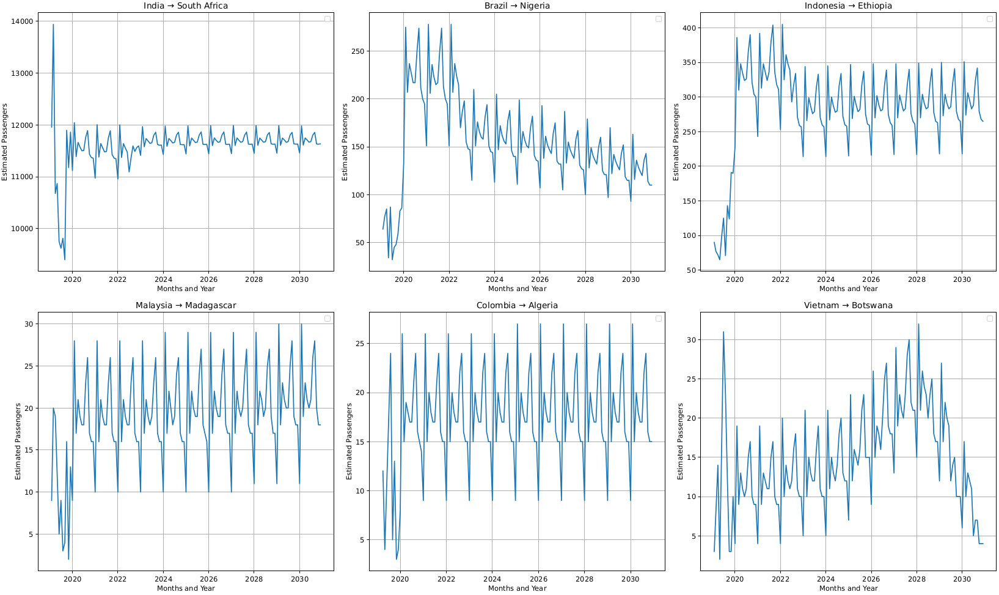

# Machine Learning for Human Mobility in Africa.

This project develops a machine learning pipeline to predict future air passenger volume between countries. It leverages a hybrid modeling approach, combining a classical Gradient Boosting model (XGBoost) with a modern deep learning architecture (Transformer) to capture different patterns in the data.

The primary goal is to forecast monthly passenger traffic on various international routes incuding Africa, Asia and South America to the year 2030 in order to provide insights into the potential evolution of global mobility for public health interventon.

## Data Sources

The models are trained on a rich, aggregated dataset compiled from several public sources:

- **Flight and Passenger Data**: Historical passenger counts and flight routes were sourced from the **International Air Transport Association (IATA)**.
- **Economic & Demographic Data**: Country-level statistics, including annual Population, GDP, and Tourism Arrivals, were collected from the **World Bank Open Data** portal.
- **Geospatial Data**: Airport IATA/ICAO codes and their corresponding geographical coordinates (latitude/longitude) were used to calculate flight distances.

## Key Features

- **Comprehensive Data Integration**: Merges flight data with economic, demographic, and geospatial information to create a robust feature set.
- **Advanced Feature Engineering**: Calculates great-circle flight distances, engineers cyclical time-based features, and creates a crucial lagged feature for the previous month's passenger volume.
- **Hybrid Modeling**: Implements both an XGBoost Regressor for its performance on tabular data and a custom Transformer-based network to capture sequential patterns.
- **Iterative Forecasting**: Employs a forward-chaining loop to predict future traffic month-by-month, using each new prediction as an input for the next.
- **Rich Visualizations**: Generates insightful plots, including:
    - Feature importance charts.
    - Model performance and error analysis heatmaps.
    - Geographical air flow maps using Cartopy to visualize historical vs. predicted traffic.

## Final Prediction for some routes: 2019 to 2030

Here is a sample visualization generated by the project, capturing the evolution of Air Flow between 2019 to 2030.



## Repository Structure

```
human-mobility-prediction/
├── data/                  # Raw data files (e.g., from IATA, World Bank - to be collected)
├── models/                # Trained model artifacts (scalers, encoders, .json, .keras, created when executed)
├── plots/                 # Generated plots and visualizations
├── predictions/           # CSV files with model predictions (created when executed)
├── source/                   # All Python source code scripts
│   ├── 01_data_preprocessing.py
│   ├── 02_feature_engineering.py
│   ├── 03_train_xgboost.py
│   ├── 04_train_transformer.py
│   ├── 05_predict_future.py
│   └── 06_analysis_and_plots.py
├── README.md
```

## Setup and Installation

1.  **Clone the repository:**
    ```bash
    git clone https://github.com/YOUR_USERNAME/human-mobility-prediction.git
    cd human-mobility-prediction
    ```

2.  **Create and activate a Python virtual environment:**
    ```bash
    python -m venv venv
    source venv/bin/activate  # On macOS/Linux
    # venv\Scripts\activate    # On Windows
    ```

3.  **Install the required dependencies:**
    ```bash
    pip install -r requirements.txt
    ```

4.  **Add Data**: Place all your raw `.xlsx` and `.csv` data files into the `data/` directory.

## How to Run the Pipeline

The scripts in the `source/` directory are designed to be run sequentially. Execute them from the root directory of the project.

1.  **Preprocess and Merge Data**:
    This script loads all raw data, cleans it, and merges it into a single file.
    ```bash
    python source/01_data_preprocessing.py
    ```

2.  **Engineer Features**:
    This script creates the `Prev_passenger` lagged feature.
    ```bash
    python source/02_feature_engineering.py
    ```

3.  **Train the XGBoost Model**:
    Trains the XGBoost model and saves the model file, scalers, and encoders.
    ```bash
    python source/03_train_xgboost.py
    ```

4.  **Train the Transformer Model**:
    Trains the Transformer neural network and saves the model file.
    ```bash
    python source/04_train_transformer.py
    ```
    
5.  **Generate Future Predictions**:
    This is the core prediction step. It loads both trained models and iteratively forecasts passenger volume from 2020 to 2031. **Note: This script may take a significant amount of time to run.**
    ```bash
    python source/05_predict_future.py
    ```

6.  **Create Analysis and Plots**:
    Generates all final visualizations, including time-series plots and global flow maps.
    ```bash
    python source/06_analysis_and_plots.py
    ```

After running the full pipeline, all model artifacts, predictions, and plots will be available in their respective directories.
